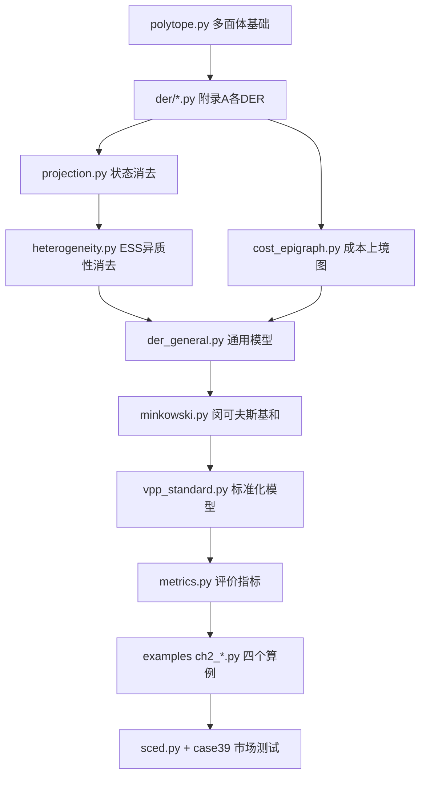

# 文献前两章复现指南

> **文献**：李楚一，《面向电力市场的虚拟电厂标准化模型构建与运行优化》，清华大学博士学位论文，2026.  
> **目标**：复现第 1 章（引言）与第 2 章（面向市场互动的虚拟电厂标准化模型结构）的代码实现建议。  
> **关联项目**：TDM（Transmission-Distribution-Microgrid Coordination）

---

## 1. 复现范围划分

| 章节 | 文献内容 | 代码复现重点 |
|------|----------|--------------|
| **第 1 章** | 研究背景、火电机组 vs VPP 原始模型 vs 标准化模型、外特性等效原则 | 问题建模与数据结构定义，少量对照算例 |
| **第 2 章** | DER 通用模型 → 状态异质性消去 → VPP 标准化模型 → 闵可夫斯基和 → 算例 2.5 | **主要开发量**，建议按 2.2 → 2.4 → 2.5 顺序实现 |

### 1.1 第 1 章：问题框架（轻量代码）

第 1 章以背景与问题定义为主，代码侧重点是**建立三类模型的对照关系**：

- VPP 原始模型（图 1.1 左）：各 DER 内部状态、基线功率、SOC 等，非标准化
- 传统火电机组市场参与模型（图 1.1 右）：功率边界、爬坡、启停、量价对等
- VPP 标准化模型（第 2 章构建）：在火电机组框架上扩展状态边界、一阶差分状态方程、状态成本

两个技术难点（第 4、5 章）在第 1–2 章仅做**确定性结构**铺垫，暂不实现不确定性聚合与配网安全修正。

### 1.2 第 2 章：核心实现

第 2 章是主要开发目标，核心链条为：

```
典型 DER 模型（附录 A）
    → DER 通用模型（表 2.1，§2.2）
    → 状态异质性消去（§2.3，以 ESS 为例）
    → 功率-成本空间成本上境图的闵可夫斯基和（§2.4）
    → VPP 标准化模型（式 2.30）
    → 算例验证（§2.5）
```

---

## 2. 推荐目录结构

在现有 `src/tdm/models/` 基础上扩展：

```
src/tdm/
├── models/
│   ├── der/                      # 附录 A：各类 DER 原始/矩阵形式
│   │   ├── base.py               # DER 基类、时段、参数 dataclass
│   │   ├── pv_wt.py              # (A.4)(A.5)
│   │   ├── dg.py                 # (A.6)(A.7) — 可承接 DG_models.py
│   │   ├── hvac.py               # (A.8)(A.9)
│   │   ├── ev.py                 # (A.10)(A.11)
│   │   ├── ess.py                # (A.12)(A.13)，含修正约束 (2.12)
│   │   └── cost.py               # 零成本/功率成本/状态成本 (2.6–2.8)
│   ├── polytope.py               # H 表示多面体、矩阵 Ξ/Φ (附录 A.1)
│   ├── projection.py             # 状态消去（高斯消元）、FME/低维精确投影
│   ├── heterogeneity.py          # 2.3.2 状态异质性消去（复杂→通用模板 MIA）
│   ├── der_general.py            # 表 2.1：通用 DER 模型 (2.5a)(2.5b)
│   ├── cost_epigraph.py          # 成本上境图 (2.20–2.27)
│   ├── vpp_standard.py           # VPP 标准化模型 (2.29)(2.30)
│   ├── thermal_unit.py           # 第 1 章对照：传统火电机组参与模型
│   ├── vpp_raw.py                # （可选）VPP 原始模型参数结构
│   ├── matpower_case.py          # 已有；扩展 case39
│   └── network.py                # 已有
├── aggregation/
│   └── minkowski.py              # 闵可夫斯基和 (2.14)、代数聚合 (2.17)
├── evaluation/
│   ├── metrics.py                # GMP / GMVR / GMPG (2.32)(2.33)
│   └── sampling.py               # hit-and-run 采样、回溯 LP (2.31)
├── market/
│   └── sced.py                   # 2.5.4：山西规则 SCED + LMP
├── data/
│   └── ch2/                      # 表 2.2–2.4 等 YAML 参数
examples/
├── ch2_ess_correction.py         # 2.5.2.1
├── ch2_minkowski_closure.py      # 2.5.2.2
├── ch2_small_scale.py            # 2.5.3
└── ch2_case39_market.py          # 2.5.4
tests/
├── test_der_models.py
├── test_polytope.py
├── test_minkowski.py
└── test_ch2_metrics.py
docs/
└── ch1_ch2_reproduction_guide.md # 本文档
```

---

## 3. 各模块任务（对应论文章节）

### 3.1 第 1 章相关

#### `models/thermal_unit.py`

- 实现传统火电机组市场参与模型：功率边界、爬坡、启停（可简化）、分段线性量价对
- 用于 §2.5.4 与标准化模型对比（图 2.13、2.14）

#### `models/vpp_raw.py`（可选）

- 用 dataclass 描述 VPP 原始模型参数结构（图 1.1）
- 不追求完整优化，主要用于说明「非标准化、难交互」

#### `docs/ch1_problem_statement.md`（可选）

- 归纳三个模型层次：原始模型 / 火电机组模型 / 标准化模型
- 对应 §1.2 两个技术难点：执行率（第 4 章）、配网安全（第 5 章）

---

### 3.2 §2.2：DER 通用模型

#### `models/polytope.py`（基础设施，优先实现）

- `Polytope(A, b)`：`A @ x <= b`
- 构造矩阵 `Ξ`（爬坡差分）、`Φ`（状态递推，附录 A.2–A.3）
- `contains(x)`、`sample_hit_and_run()`

#### `models/der/*.py`（附录 A）

各 DER 从物理参数生成 H 表示：

| 文件 | 对应公式 | 说明 |
|------|----------|------|
| `pv_wt.py` | (A.4)(A.5) | 功率上下界 |
| `dg.py` | (A.6)(A.7) | 功率 + 爬坡 |
| `hvac.py` | (A.8)(A.9) | 温度状态消去后的 4τ 维约束 |
| `ev.py` | (A.10)(A.11) | 与 HVAC 同结构 |
| `ess.py` | (A.12)(A.13) | (2.9) + 修正约束 (2.12) |

#### `models/der/cost.py`

- 分段线性功率成本 `f_t(P_t)`（式 2.6、2.7）
- 状态成本 `g_t(S_t)`（式 2.8，HVAC 舒适度）
- 输出 ISO 申报用的斜率/截距矩阵 `F_t, f_t, G_t, g_t`（式 2.28）

#### `models/der_general.py`

- 统一接口：`build_power_polytope(τ)`、`build_cost_epigraph()`
- 实现表 2.1 四类约束/成本组合
- 对无状态 DER，通过参数松弛使状态约束冗余（图 2.6）

---

### 3.3 §2.3：状态异质性消去（ESS）

#### `models/ess.py`

- 完整非理想 ESS：式 (2.9) 松弛模型 + 修正约束 (2.12)
- 高维变量 `[E, P_in, P_out, P]` 的等式与不等式

#### `models/projection.py`

- **简单 DER**（HVAC/EV）：利用 `Φ` 矩阵代数消状态 → 端口功率多面体
- **复杂 DER**（ESS）：低维（τ=2, 5）用 FME 或顶点枚举做**精确投影**；高维用估计接口

#### `models/heterogeneity.py`

- 以通用模板（功率边界 + 爬坡 + 单状态一阶差分）对复杂 DER 投影做 **MIA（最大内估计）**
- 对应 §2.3.2、图 2.2
- 第 3 章会有完整 LP-MIA；第 2 章可先用简化版（位似变换 / cvxpy 线性规划）

---

### 3.4 §2.4：VPP 标准化模型与闵可夫斯基和

#### `aggregation/minkowski.py`

- 定义式 (2.14)：`Ω(b1) ⊕ Ω(b2)`
- 实现命题 2.1 的**代数聚合**：`Ω(b1 + b2)`（同约束矩阵 A）
- 功率可行域聚合：多个 DER 端口多面体求和

#### `models/cost_epigraph.py`

- 构建单体成本上境图 `epi(z_k,t)`（式 2.21）
- 聚合（式 2.26）：`epi(z0,t) = ⊕_k epi(z_k,t)`
- 投影到功率子空间得到聚合可行域

#### `models/vpp_standard.py`

- 完整标准化模型（式 2.30）：
  - **可行域**（式 2.29）：功率边界、爬坡、状态边界、一阶差分状态方程
  - **成本**（式 2.28）：分时段功率/状态分段线性成本
- `from_der_list(ders)`：先聚合再上境图，再拟合标准化参数
- `relax_unused_features()`：DG/PV 无状态时置零状态项

---

### 3.5 §2.5：算例与评价指标

#### `evaluation/metrics.py`

| 指标 | 公式 | 含义 |
|------|------|------|
| GMP / Recall | (2.31) | 估计多面体采样点能否回溯到原多面体 |
| GMVR | (2.32) | 交叉采样体积比（覆盖率） |
| GMPG | (2.33) | 参数上下界间隙 |

#### `evaluation/sampling.py`

- hit-and-run 均匀采样（文献 [98]）
- 闵可夫斯基和/投影情形的回溯可行性 LP

#### 算例脚本与目标指标

| 脚本 | 对应节 | 验证目标 |
|------|--------|----------|
| `ch2_ess_correction.py` | 2.5.2.1 | 表 2.2；τ=2, 5：修正后 GMP≈100%，GMVR 缩小约 5–7% |
| `ch2_minkowski_closure.py` | 2.5.2.2 | 表 2.3；维度 3–12，代数聚合 GMP > 99.8% |
| `ch2_small_scale.py` | 2.5.3 | 1 DG + 1 HVAC + 1 ESS，τ=3；GMVR: 100% / 91.2% / 88.0% |
| `ch2_case39_market.py` | 2.5.4 | IEEE 39 节点、24 时段 SCED；LMP 降低 ~6%，VPP 盈利提升 ~165% |

#### `market/sced.py`

- 按山西规则构建日前 SCED（文献 [14]）
- VPP 作为报价主体接入节点 5
- 对比 `thermal_unit` 与 `vpp_standard` 两套参数
- 输出 LMP 分布、系统成本、VPP 收益（复现图 2.12–2.14）

#### `data/ch2/*.yaml`

- 集中存放表 2.2–2.4 参数，便于算例与测试复用

**统一单位约定（代码默认）**

| 量 | 单位 |
|----|------|
| 端口功率 P | MW |
| 储能能量 E / VPP 状态 S | MWh |
| 爬坡速率 | MW/h |
| 时间步长 Δτ | h（默认 1） |
| 成本价格档 | $/MWh（五档: -80, -40, 0, 40, 80） |
| HVAC 温度 | °C |
| HVAC 系数 α | °C/(MW·h)（论文 kW 值 ×1000） |

论文 kW/kWh 算例可通过 `der.reference_params` 自动换算；见 `der.units.KW_TO_MW`。

**表 2.2 非理想 ESS 参数（§2.5.2.1，代码内为 MW/MWh）**

| 参数 | 论文 (kW/kWh) | 代码 (MW/MWh) |
|------|---------------|---------------|
| [P̲, P̄] | [-50, 50] | [-0.05, 0.05] |
| [E̲, Ē] | [0, 100] | [0, 0.1] |
| E₀ | 80 | 0.08 |
| [η, α_in, α_out] | [0.95, 0.9, 1.1] | 同左（无量纲） |

**表 2.4 DG 和 HVAC 参数（§2.5.3，代码内为 MW）**

| DER | [P̲, P̄] | [δ̲, δ̄] | [T̲, T̄, T₀] (°C) | [η, α] | w_t (°C) |
|-----|---------|---------|-----------------|--------|----------|
| DG | [0.04, 0.08] MW | [0.03, 0.03] MW/h | — | — | — |
| HVAC | [0, 0.11] MW | — | [22, 26, 26] | [1.04, -50]* | [32.4, 34.4, 34.9] |

\* α = -0.05 °C/(kW·h) → -50 °C/(MW·h)

---

## 4. 与现有代码的衔接

| 现有文件 | 建议 |
|----------|------|
| `DG_models.py` | 迁入 `models/der/dg.py`，实现 `construct_dg_polytope(params, tau)`，返回 `Polytope` 而非裸 `ndarray` |
| `matpower_case.py` | 扩展 `load_case39()`（PYPOWER 自带 `case39`），用于 §2.5.4；33 节点留作第 5 章配网安全 |
| `network.py` | 保持不变，供后续配网约束嵌入使用 |

### 4.1 求解器选择

| 用途 | 文献方案 | 本项目建议 |
|------|----------|------------|
| 回溯 LP (2.31) | YALMIP + Gurobi | **cvxpy**（已在 environment.yml） |
| 低维 MIA | 位似变换法 | cvxpy 线性规划（简化版） |
| 完整投影 MIA | LP 对等转化（第 3 章） | 第 3 章再考虑 Gurobi/CPLEX |

### 4.2 依赖补充

当前 `environment.yml` 已包含：

- `pypower` — case39、SCED
- `cvxpy` — LP 可行性、简单 MIA
- `matplotlib` — 图 2.8–2.11 可视化

无需额外安装即可启动第 2 章基础实现。

---

## 5. 建议实现顺序



**第 1 章**可在步骤 A 之前并行完成 `thermal_unit.py` 与问题说明文档。

### 5.1 最小可验证里程碑

1. **ESS 修正约束算例**（§2.5.2.1）通过 → 多面体与投影正确
2. **代数闵可夫斯基 GMP > 99.8%**（§2.5.2.2）→ 聚合核心正确
3. **3 时段 DG+HVAC+ESS 通用模型拟合**（§2.5.3）→ 端到端 DER→VPP 链路打通

---

## 6. 第 2 章暂可不实现（留给第 3 章）

以下内容为第 3 章核心，第 2 章算例可先用简化 MIA 替代：

- 投影标准化的完整 LP-MIA（§3.2–3.3）
- 同位多面体位似变换参数辨识（§3.5）
- 分层聚合框架（§3.4）

第 2 章算例中「通用模型/标准化模型拟合」可先用**简化 MIA**（固定模板 + cvxpy 缩放/平移），与文献数值趋势一致即可；第 3 章再替换为论文完整算法。

---

## 7. 测试建议

```python
# tests/test_dg.py — 验证 (A.7) 维数: (4τ-2) × τ
# tests/test_ess.py — τ=2 时修正前后 GMP
# tests/test_minkowski.py — 随机同 A 矩阵，b1+b2 代数聚合
# tests/test_epigraph.py — DG+ESS 两时段，采样点落在上境图边界
```

---

## 8. 关键公式索引

| 编号 | 内容 | 实现模块 |
|------|------|----------|
| (2.1)(2.2) | 端口功率边界与爬坡 | `der/pv_wt.py`, `der/dg.py` |
| (2.3)(2.4)(2.5) | 状态耦合约束（HVAC/EV/通用） | `der/hvac.py`, `der/ev.py` |
| (2.6)(2.7)(2.8) | 运行成本（功率/状态） | `der/cost.py` |
| (2.9)(2.12) | 非理想 ESS + 修正约束 | `der/ess.py` |
| (2.14)(2.17) | 闵可夫斯基和与代数聚合 | `aggregation/minkowski.py` |
| (2.20)–(2.27) | 成本上境图 | `models/cost_epigraph.py` |
| (2.29)(2.30) | VPP 标准化模型 | `models/vpp_standard.py` |
| (2.31)–(2.33) | 评价指标 GMP/GMVR/GMPG | `evaluation/metrics.py` |
| (A.1)–(A.13) | 附录 A 矩阵形式 | `models/polytope.py`, `models/der/*.py` |

---

## 9. 参考文献（本文档涉及）

- [14] 山西电力市场规则（SCED 模型，§2.5.4）
- [28] Yi 等，位似变换法 MIA（§2.5.1.3）
- [41] Barot 等，闵可夫斯基和外估计（§1.3.2.1）
- [45] Li 等，投影消去与拟合（§2.5.3）
- [98] Kaufman & Smith，hit-and-run 采样（§2.5.1.1）

---

*文档生成依据：TDM 项目现状 + 博士学位论文第 1–2 章内容梳理。*
