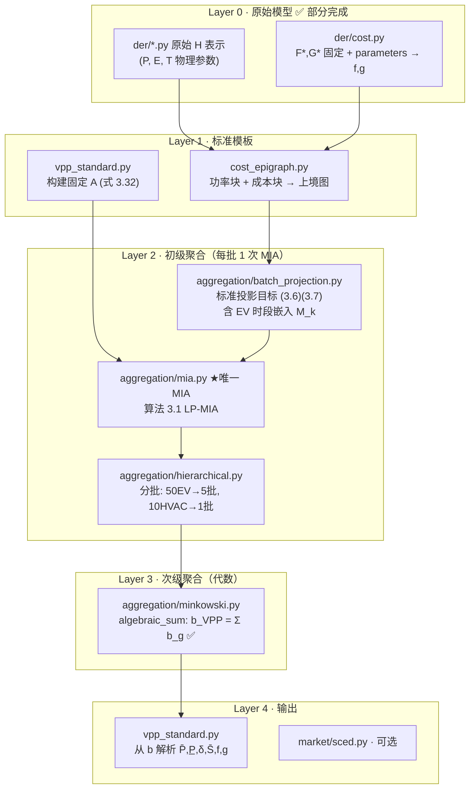

# VPP 聚合实现 TODO

> 依据论文第 2–3 章及本项目已确定的实现策略整理。  
> **核心流程**：原始 DER →（必要时功率 MIA）→ 标准模板 (A 固定) → 初级分批 MIA → 次级 Σb → 市场参与参数。

---

## 流程总览



**已确认的设计决策**

| 决策 | 说明 |
|------|------|
| 成本不经过 MIA | `F*,G*` 固定；`f,g` 由 `parameters` 直接计算 |
| 次级聚合 | 同 A 下 **b 代数相加**，不再 MIA |
| 初级聚合 | 每批 **标准投影 + 一次 MIA**（非 per-DER MIA 再相加） |
| 单位 | MW / MWh / MW·h⁻¹ / $/MWh |

---

## Phase 0 — 已完成 ✅

- [x] `der/base.py` — Ξ/Φ、`get_tau`
- [x] `der/pv_wt.py`, `dg.py`, `hvac.py`, `ev.py`, `ess.py` — 原始功率 H 表示
- [x] `der/units.py` — MW 单位、`PRICE_SEGMENTS_MWH`
- [x] `der/reference_params.py` — 表 2.2/2.4 参考参数
- [x] `polytope.py` — `Polytope`、`contains`、`algebraic_sum`
- [x] `aggregation/minkowski.py` — `algebraic_minkowski_sum`

---

## Phase 1 — 标准参与模板（固定 A）

**目标**：实现式 (3.32) 的约束矩阵 **A**（不含 MIA，纯构造）。

**文件**：`models/vpp_standard.py`

- [ ] **1.1** `StandardTemplate` dataclass
  - 字段：`tau`, `A`, `F_star`, `G_star`, `B`（式 3.30 固定 `a_t=b_t=1`）
  - 固定：`S0=0`, `C_t=0`（式 3.5.2.2）
- [ ] **1.2** `build_template_matrix(tau) -> np.ndarray`
  - 组装 (3.32) 左侧分块：`[-I, F*]`, `[-I, G*B]`, `[I/I/Ξ/B]` 等
  - 行顺序与 `b` 解析顺序文档化（便于 `parse_b`）
- [ ] **1.3** `template_polytope(b) -> Polytope`
  - 给定右端 `b`，返回 `Polytope(A, b)`
- [ ] **1.4** 测试 `tests/test_vpp_standard.py`：A 维数、F*=G*=五档价格

**依赖**：`der/units.PRICE_SEGMENTS_MWH`、`der/cost.fixed_price_slopes()`

---

## Phase 2 — 成本模块（独立于 MIA）

**目标**：从 `parameters` + 固定 `F*,G*` 直接算右端截距，不调用 MIA。

**文件**：`models/der/cost.py`

- [ ] **2.1** `PiecewiseLinearCost` dataclass：`slopes`, `intercepts`（形状 `(n_seg,)` 或 `(tau, n_seg)`）
- [ ] **2.2** `zero_cost(tau) -> PiecewiseLinearCost`
- [ ] **2.3** `build_power_cost_rhs(params) -> np.ndarray`
  - 线性成本：`unit_cost` $/MWh（DG、ESS `λ|P|`）
  - 映射到五档 `F*` 下的 `f_t`
- [ ] **2.4** `build_state_cost_rhs(params) -> np.ndarray`
  - HVAC：`comfort_lambda`, `T_comf` → `g_t`（式 2.8）
- [ ] **2.5** `evaluate_cost(power, state, params) -> float`（可选，用于验证）
- [ ] **2.6** 测试：表 2.5.3 成本（DG 0.075→换 MW 后 75 $/MWh 等）

**注意**：此处产出的是**单体 DER** 的 `f_k, g_k`，不是 VPP 级。

---

## Phase 3 — 上境图组装

**目标**：把功率多面体 + 成本截距拼成参与模型可行域（仍可用 `Polytope` 或专用结构）。

**文件**：`models/cost_epigraph.py`

- [ ] **3.1** `build_der_epigraph_rhs(power_poly, cost_power, cost_state, template) -> np.ndarray`
  - 将 `der/*.py` 的 `A_p,b_p` 与 `f,g` 填入模板 `b` 的对应槽位
- [ ] **3.2** `build_der_participation_model(der_type, params) -> Polytope`
  - 统一入口：原始功率 + cost → `Polytope(A_template, b_k)`
  - **不**做 MIA；若 ESS 等需先 `heterogeneity.py` 功率 MIA 再填入（见 Phase 4 注）
- [ ] **3.3** 测试：单体 DG 的 `b` 与手算一致

**与 MIA 的分工**

| 步骤 | 是否 MIA |
|------|----------|
| `cost.py` 算 f,g | 否 |
| `cost_epigraph` 拼 b | 否 |
| 原始 ESS→通用功率模板 | 是（`heterogeneity.py`，§2.3） |
| 一批 DER→标准 (A,b) | 是（Phase 4） |

---

## Phase 4 — 初级聚合：标准投影 + MIA

**目标**：一批 DER（如 10 个 EV）→ 一个 `(A, b_batch)`。

**文件**

| 文件 | 任务 |
|------|------|
| `aggregation/batch_projection.py` | 标准投影目标 (3.6)(3.7)；EV 时段矩阵 `M_k`；**不含 MIA** |
| `aggregation/mia.py` | **★ 唯一 MIA 实现**：`solve_mia` / `fit_to_template` / `primary_aggregate` |
| `models/projection.py` | FME/高斯消元（低维验证）；**不含 MIA** |
| `models/heterogeneity.py` | Ch2 ESS 工作流；**调用** `mia.fit_to_template`，不实现 LP |

- [ ] **4.1** `build_batch_projection_problem(der_list, template) -> ProjectionProblem`
  - 输入：同类型多个 DER 的原始约束
  - 输出：标准投影 LP 的聚合目标（闵可夫斯基和/投影等价形式）
- [ ] **4.2** `solve_mia(template, target) -> np.ndarray`
  - 内估计：最大化 b（集合包含意义下）的 LP 表述（§3.3 Farkas/LP 对等）
- [ ] **4.3** `primary_aggregate(der_batch, template) -> Polytope`
  - `build_batch_projection` + `solve_mia` → `(A, b)`
- [ ] **4.4** `embed_period_heterogeneity(ev_params, tau_total) -> M_k`
  - 式 (3.7b)，EV 可用时段嵌入
- [ ] **4.5** 测试：2 个 EV（表 3.1）初级聚合 vs FME 参考（小规模）

**不要实现**：50 次 per-EV MIA 再 `sum(b)`（误差累积，论文明确不推荐）。

---

## Phase 5 — 分层聚合编排

**目标**：50 EV + 10 HVAC + 10 PV → `b_VPP = Σ b_g`。

**文件**：`aggregation/hierarchical.py`

- [ ] **5.1** `group_der_list(der_list, max_group_size=12) -> list[list]`
  - 默认 6–12（§3.6.4）；按类型先分组再分批
- [ ] **5.2** `aggregate_by_type(der_specs, template) -> dict[str, Polytope]`
  - 例：`{"ev": (A,b_ev), "hvac": (A,b_hvac), "pv": (A,b_pv)}`
  - 每类内部：多批 `primary_aggregate` → 类内 `algebraic_minkowski_sum`
- [ ] **5.3** `secondary_aggregate(polytopes: list[Polytope]) -> Polytope`
  - 校验 `A` 相同 → `algebraic_minkowski_sum`（已有）
- [ ] **5.4** `aggregate_vpp(der_specs, *, group_size=10) -> Polytope`
  - 顶层：`aggregate_by_type` → `secondary_aggregate`
- [ ] **5.5** 测试：模拟 5×10 EV + 1×10 HVAC，`A` 一致、`b` 维数正确

**示例调用（目标 API）**

```python
from tdm.aggregation.hierarchical import aggregate_vpp
from tdm.models.vpp_standard import build_standard_template

template = build_standard_template(tau=24)
vpp_poly = aggregate_vpp(
    der_specs=[("ev", ev_params_i) for i in range(50)] + [("hvac", hvac_j) for j in range(10)],
    template=template,
    group_size=10,
)
```

---

## Phase 6 — 参数解析与市场模型

**文件**：`models/vpp_standard.py`（续）

- [ ] **6.1** `parse_participation_params(b, tau) -> VPPParticipationParams`
  - 从 `b` 拆：`P_bar`, `P_under`, `delta`, `S_bar`, `S_under`, `f`, `g`
  - 对应式 (3.33)(3.34)
- [ ] **6.2** `VPPParticipationParams.to_market_dict()` — ISO 申报结构
- [ ] **6.3** `relax_unused_features()` — 无状态 DER 松弛状态行（图 2.6）

---

## Phase 7 — 评价与算例（Ch2/Ch3）

**文件**

| 文件 | 任务 |
|------|------|
| `evaluation/metrics.py` | GMP, GMVR, GMPG |
| `evaluation/sampling.py` | hit-and-run、回溯 LP (2.31) |
| `examples/ch3_small_batch.py` | 2 EV + 4 HVAC 复现 |
| `examples/ch3_large_scale.py` | 10PV+10HVAC+50EV 分层聚合 |
| `data/ch2/*.yaml` | 批量 DER 参数 |

- [ ] **7.1** 指标模块
- [ ] **7.2** §2.5.2.1 ESS 修正约束算例
- [ ] **7.3** §3.6.2 大规模分层聚合算例

---

## Phase 8 — 后续章节（低优先级）

- [ ] `market/sced.py` — §2.5.4 IEEE39
- [ ] `models/thermal_unit.py` — 传统机组对照
- [ ] 第 4 章 JCC、第 5 章 GOE（另立 TODO）

---

## 推荐实现顺序

```
1 → 2 → 3 → 4.1–4.3 → 5 → 6 → 7
         ↑
    可并行：4.4 ESS/heterogeneity（Ch2 验证用）
```

| 优先级 | 模块 | 理由 |
|--------|------|------|
| P0 | Phase 1 标准模板 A | 后续 MIA/代数聚合都依赖固定 A |
| P0 | Phase 2 成本 RHS | 与 MIA 解耦，可立即写 |
| P1 | Phase 3 上境图组装 | 连接 DER 与模板 |
| P1 | Phase 4 MIA | 初级聚合核心 |
| P1 | Phase 5 分层编排 | 50EV+10HVAC 主流程 |
| P2 | Phase 6 参数解析 | 市场输出 |
| P2 | Phase 7 算例/指标 | 对照论文 |

---

## 当前代码缺口速查

| 模块 | 状态 | 下一步 |
|------|------|--------|
| `der/cost.py` | 存根 + 语法已修 | Phase 2 |
| `cost_epigraph.py` | 存根 | Phase 3 |
| `vpp_standard.py` | 存根 | Phase 1 + 6 |
| `aggregation/mia.py` | **缺失** | Phase 4 新建 |
| `aggregation/batch_projection.py` | 存根 | Phase 4 |
| `aggregation/hierarchical.py` | **缺失** | Phase 5 新建 |
| `heterogeneity.py` | 存根 | Phase 4.5 / Ch2 |
| `evaluation/*` | **缺失** | Phase 7 |

---

## 单批 10 EV 数据流（实现时对照）

```
10 × ev_params
  → 10 × build_ev_polytope()           # der/ev.py，原始功率 H
  → 10 × cost: f,g from parameters     # der/cost.py，无 MIA
  → build_batch_projection_problem(10 EV)  # aggregation/batch_projection.py
  → solve_mia(template, projection)        # aggregation/mia.py ★ → b_batch
  → Polytope(A, b_batch)

5 个 b_batch  →  algebraic_sum  →  b_EV
b_EV + b_HVAC + b_PV  →  b_VPP
  →  parse_participation_params(b_VPP)  # vpp_standard.py
```
